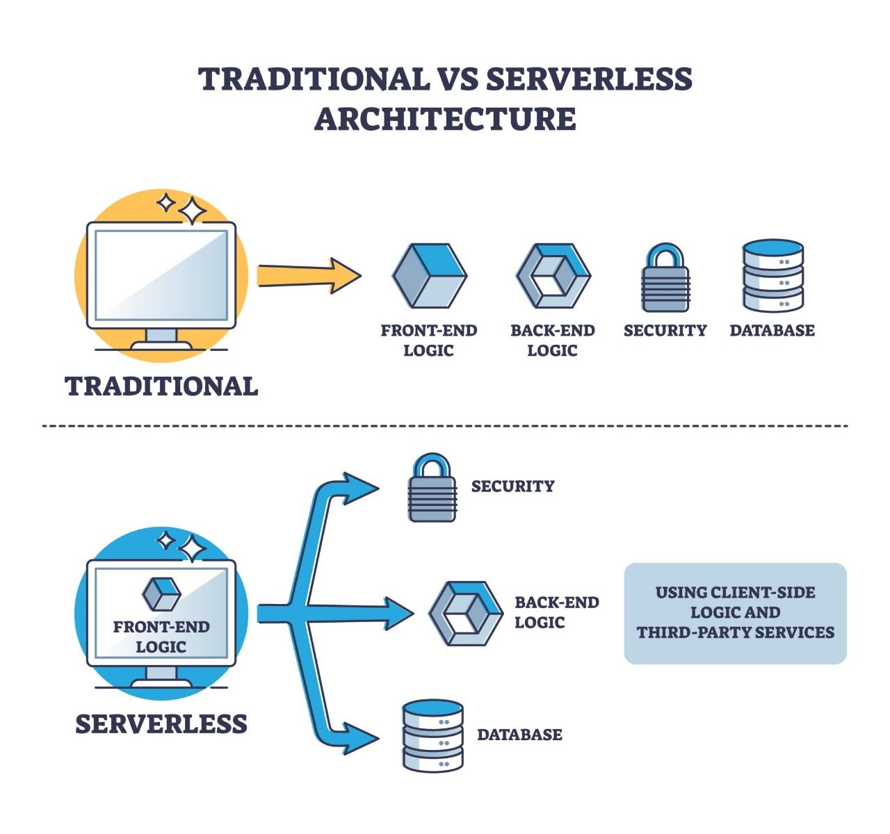

# How to Set Up a 3-Node Docker Swarm in VirtualBox

This guide outlines the step-by-step process to set up a Docker Swarm cluster using Oracle VirtualBox and Ubuntu Server. We will configure one **Manager** node and two **Worker** nodes.

## 📼 My Channel 


## Arquitecture



## 📋 Prerequisites

* **Oracle VirtualBox** installed on your host machine.
* **Ubuntu Server 22.04 LTS ISO** (or a similar Linux distribution).
* Basic knowledge of the Linux command line.

## 🏗️ Architecture

We will create 3 Virtual Machines with the following configuration:

| Hostname | Role | IP Address (Host-Only) | RAM | vCPU |
| :--- | :--- | :--- | :--- | :--- |
| `swarm-manager` | Manager | **192.168.56.101** | 2GB+ | 2 |
| `swarm-worker-1` | Worker | **192.168.56.102** | 1GB+ | 1 |
| `swarm-worker-2` | Worker | **192.168.56.103** | 1GB+ | 1 |

---

## Step 1: VirtualBox Network Configuration

Before creating VMs, create a private network for node-to-node communication.

1.  Open VirtualBox.
2.  Go to **File > Tools > Network Manager**.
3.  Create a **Host-Only Network** (usually named `vboxnet0`).
4.  Ensure the IPv4 Address is `192.168.56.1` and Mask is `255.255.255.0`.

---

## Step 2: Create the Base VM (Manager)

1.  Create a new VM named `swarm-manager`.
2.  Install Ubuntu Server.
    * **Hostname:** `swarm-manager`
    * **User:** `docker-admin` (or your preference)
    * **SSH:** Select "Install OpenSSH Server" during setup.
3.  **Network Settings (Crucial):**
    * **Adapter 1:** NAT (For Internet access).
    * **Adapter 2:** Host-only Adapter (Select `vboxnet0`).

### Configure Static IP
Log into the VM and configure the Host-Only interface (`enp0s8` usually).

```bash
sudo nano /etc/netplan/00-installer-config.yaml

```

# This is the network config written by 'subiquity'
Modify the file to look like this. This sets the manager's static IP to 192.168.56.101.

```bash

network:
  ethernets:
    enp0s3:
      dhcp4: true
    enp0s8:
      dhcp4: no
      addresses:
        - 192.168.56.101/24
  version: 2

```

Apply the changes:

```bash

sudo netplan apply

```
Verify the IP: ip a show enp0s8 should now show 192.168.56.101.

### 4. Clone the VM to Create Workers

Now that you have a base VM, shut it down and clone it.

1. Right-click swarm-manager in VirtualBox and select Clone.

2.  Name: swarm-worker-1

3.  MAC Address Policy: Select Generate new MAC addresses for all network adapters. This is extremely important.

4. Choose "Full Clone" or "Linked Clone" (Linked is faster and saves space, but relies on the original).

Repeat the cloning process to create swarm-worker-2.

## Configure Worker VMs

Boot up swarm-worker-1 and swarm-worker-2 one at a time and make two small changes on each:

1. Change the hostname:

```bash

# On swarm-worker-1
sudo hostnamectl set-hostname swarm-worker-1
# On swarm-worker-2
sudo hostnamectl set-hostname swarm-worker-2

```

2. Change the static IP: Edit the netplan file (sudo nano /etc/netplan/00-installer-config.yaml) and change only the IP address.

    On swarm-worker-1: Use 192.168.56.102/24

    On swarm-worker-2: Use 192.168.56.103/24

    Apply the changes on each: sudo netplan apply

At this point, you should be able to ping all nodes from each other using their 192.168.56.x addresses. For example, from the manager: ping 192.168.56.102

## Step 3: Install Docker (On ALL 3 Nodes)

Run these commands on swarm-manager, swarm-worker-1, and swarm-worker-2.

1. Update packages:

```bash

sudo apt update
sudo apt install -y ca-certificates curl

```

2. Add Docker's official GPG key:


```bash

sudo install -m 0755 -d /etc/apt/keyrings
sudo curl -fsSL https://download.docker.com/linux/ubuntu/gpg -o /etc/apt/keyrings/docker.asc
sudo chmod a+r /etc/apt/keyrings/docker.asc

```

3. Add the Docker repository:

```bash

echo \
  "deb [arch=$(dpkg --print-architecture) signed-by=/etc/apt/keyrings/docker.asc] https://download.docker.com/linux/ubuntu \
  $(. /etc/os-release && echo "$VERSION_CODENAME") stable" | \
  sudo tee /etc/apt/sources.list.d/docker.list > /dev/null

```

4. Install Docker Engine:

```bash

sudo apt update
sudo apt install -y docker-ce docker-ce-cli containerd.io docker-buildx-plugin docker-compose-plugin

```

5. (Optional but recommended) Add your user to the docker group to avoid using sudo for every command. You'll need to log out and log back in for this to take effect.

```bash

sudo usermod -aG docker $USER
newgrp docker

```

## Step 4: Initialize the Swarm (On the Manager)

Now for the fun part.

Log into your swarm-manager node.

Run the docker swarm init command. You must specify the --advertise-addr as the Host-Only IP, not the NAT IP.

```bash

docker swarm init --advertise-addr 192.168.56.101

```

Copy the output! It will give you the command and token for your workers to join. It will look like this:

Swarm initialized: current node (abc123...) is now a manager.

To add a worker to this swarm, run the following command:

```bash
docker swarm join --token SWMTKN-1-xxxxxxxxx 192.168.56.101:2377
```

To add a manager to this swarm, run 'docker swarm join-token manager' and follow the instructions.


Note: If you lose the token, you can get it again by running this on the manager: docker swarm join-token worker

## Step 5: Join the Worker Nodes

1. Log into **swarm-worker-1**.
2. Paste and run the docker swarm join... command you copied from the manager:

```bash

docker swarm join --token SWMTKN-1-xxxxxxxxx 192.168.56.101:2377

```

It should respond with: This node joined a swarm as a worker.

3. Log into **swarm-worker-2** and run the exact same command.

```bash

docker swarm join --token SWMTKN-1-xxxxxxxxx 192.168.56.101:2377

```

## Step 6: Verify and Test the Swarm

You're all set! Go back to your swarm-manager node to verify.

1. Run **docker node ls** to see your cluster:

```bash

$ docker node ls
ID                            HOSTNAME          STATUS    AVAILABILITY   MANAGER STATUS   ENGINE VERSION
abc123xxxxxxxxxxxxxx * swarm-manager     Ready     Active         Leader           26.1.0
def456xxxxxxxxxxxxxx          swarm-worker-1    Ready     Active                          26.1.0
ghi789xxxxxxxxxxxxxx          swarm-worker-2    Ready     Active                          26.1.0

```

The * indicates you are on that node. You should see all 3 nodes as Ready and Active.

2. Deploy a test service: Let's deploy 5 replicas of Nginx.

```bash

docker service create --name my-web --replicas 5 --publish published=8080,target=80 nginx

```

3. Check the service status:

```bash

docker service ls
docker service ps my-web

```
The ps (process) command will show you which nodes your 5 Nginx containers are running on.

4. Test the routing mesh: You can access the Nginx service by browsing to **port** 8080 on any node's IP, even one that isn't running an Nginx container.

From your host machine's browser, visit:

```bash

http://192.168.56.101:8080

http://192.168.56.102:8080

http://192.168.56.103:8080

```
All three addresses should show the "Welcome to nginx!" page.

**Votes**

```bash

http://192.168.56.101:5001

```

##  A Note on Firewalls

If you have a firewall like ufw enabled on your Ubuntu VMs, you must open these ports for Swarm to work:

You would run this on all 3 nodes:

```bash

sudo ufw allow 2377/tcp
sudo ufw allow 7946/tcp
sudo ufw allow 7946/udp
sudo ufw allow 4789/udp
sudo ufw reload

```

## 🛑 To change the HostName

1. Use the command

```bash

sudo hostnamectl set-hostname swarm-manager

```

**Note**: You may need to log out and log back in to see the new name in your terminal.

2. To create the new user (docker-admin)

Use the **adduser command**. It's an interactive script that will ask for your password and other details.

```bash

sudo adduser docker-admin             

```
The system will ask you to create a password for the new user.

Then it will ask for their full name and other optional details. You can press Enter to leave these questions blank.

Confirm that the information is correct.

If you want this new user to have administrator privileges (to be able to use sudo), run this additional command:

```bash

sudo usermod -aG sudo docker-admin          

```

## To install the OpenSSH Server

This is done using the apt package manager.

1. Update your package list:

```bash

sudo apt update         

```

2. Instala el paquete **openssh-server**:

```bash

sudo apt install openssh-server        

```

3. Verifica que el servicio esté corriendo:

```bash

sudo systemctl status ssh      

```

(You should see "active (running)" in green. Press q to exit.)

4. (Important) If you have the ufw firewall enabled, you need to allow SSH:

```bash

sudo ufw allow ssh    

```